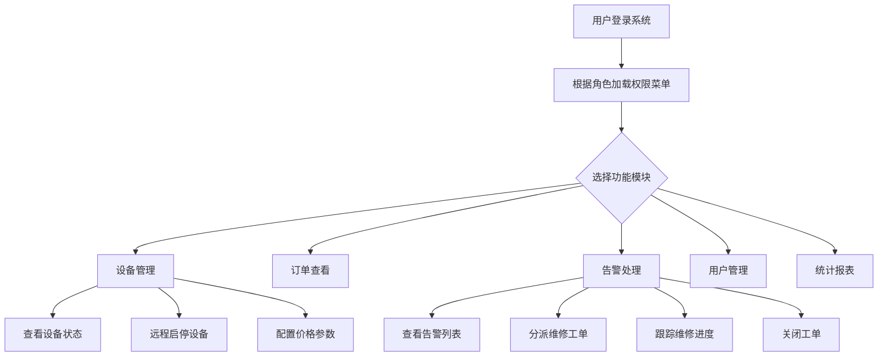

## 1. 产品概述

小区自助饮水设备后台管理系统，服务于物业管理人员和运营人员，用于集中管理楼栋内的自助取水机设备。系统实现设备监控、订单管理、用户运营、告警处理等全流程数字化管理，提升运维效率和用户体验。

- 目标用户：物业管理员、运营人员、维修人员、系统管理员
- 产品价值：实现取水设备的远程集中管理，降低运维成本，保障水质安全，提升用户满意度

## 2. 核心功能

### 2.1 用户角色

| 角色 | 登录方式 | 核心权限 |
|------|---------|---------|
| 超级管理员 | 账号密码 | 全部功能，系统设置、角色权限管理 |
| 物业管理员 | 账号密码 | 设备管理、订单查看、用户管理、告警处理 |
| 运营人员 | 账号密码 | 套餐管理、优惠券发放、数据统计、报表导出 |
| 维修人员 | 账号密码 | 告警工单查看、维修进度登记 |

### 2.2 功能模块

1. **首页看板**：设备总数、在线率、今日订单、告警概览、设备地图、近期取水量趋势
2. **设备管理**：设备列表、地图定位、在线/离线状态、余量监控、水质指标、远程启停、价格配置
3. **订单流水**：取水订单列表、筛选查询、订单详情、数据导出
4. **充值套餐**：套餐列表、新增/编辑套餐、上下架管理、价格配置
5. **告警工单**：告警列表、异常类型筛选、工单分派、维修进度登记、工单关闭
6. **用户账户**：用户列表、余额查看、充值记录、退款审核、用户拉黑、优惠券发放
7. **统计报表**：取水量统计、收入统计、设备使用率、用户增长、数据导出
8. **系统设置**：角色权限、操作日志、基础参数配置

### 2.3 页面详情

| 页面名称 | 模块名称 | 功能描述 |
|---------|---------|-----------|
| 首页看板 | 数据概览卡片 | 展示设备总数、在线数量、离线数量、今日订单数、今日收入、待处理告警数 |
| 首页看板 | 设备分布地图 | 地图展示所有设备位置，标记在线/离线状态，点击查看设备详情 |
| 首页看板 | 趋势图表 | 近7天取水量趋势折线图、设备使用率柱状图 |
| 首页看板 | 实时告警 | 最新告警列表，快速跳转告警工单 |
| 设备管理 | 设备列表 | 分页展示所有设备，支持按楼栋、状态、设备编号搜索筛选 |
| 设备管理 | 设备详情 | 设备基本信息、实时状态、水质指标（TDS、PH、余氯）、剩余水量 |
| 设备管理 | 远程控制 | 远程启动/停止设备、调整出水价格 |
| 设备管理 | 地图视图 | 切换地图模式查看设备分布 |
| 订单流水 | 订单列表 | 展示所有取水订单，支持按时间、用户、设备、状态筛选 |
| 订单流水 | 订单详情 | 查看订单完整信息，包括取水时长、水量、金额、支付方式 |
| 订单流水 | 数据导出 | 按筛选条件导出订单数据为 Excel |
| 充值套餐 | 套餐列表 | 展示所有充值套餐，包含套餐名称、金额、赠送金额、状态 |
| 充值套餐 | 套餐管理 | 新增、编辑、删除套餐，上下架操作 |
| 告警工单 | 告警列表 | 展示所有告警信息，按严重程度、状态、类型筛选 |
| 告警工单 | 工单分派 | 将告警分派给指定维修人员 |
| 告警工单 | 进度登记 | 维修人员登记处理进度、上传照片、完成工单 |
| 用户账户 | 用户列表 | 展示所有注册用户，支持搜索、筛选 |
| 用户账户 | 余额管理 | 查看用户余额、充值记录、消费记录 |
| 用户账户 | 退款审核 | 审核用户退款申请，通过或拒绝 |
| 用户账户 | 用户拉黑 | 拉黑/解禁用户，限制取水功能 |
| 用户账户 | 优惠券发放 | 选择用户发放优惠券，设置面额和有效期 |
| 统计报表 | 取水量统计 | 按日/周/月统计取水量，图表展示 |
| 统计报表 | 收入统计 | 充值收入、取水收入统计与对比 |
| 统计报表 | 设备分析 | 设备使用率排名、故障率统计 |
| 统计报表 | 用户分析 | 用户增长趋势、活跃用户统计 |
| 系统设置 | 角色管理 | 创建角色、分配菜单权限 |
| 系统设置 | 操作日志 | 记录所有操作日志，支持搜索筛选 |
| 系统设置 | 基础配置 | 价格参数、告警阈值、系统参数设置 |

## 3. 核心流程

### 3.1 设备告警处理流程

物业管理员收到设备告警 → 查看告警详情和设备信息 → 分派给维修人员 → 维修人员接单处理 → 登记维修进度和结果 → 管理员确认关闭工单

### 3.2 用户充值与消费流程

用户购买充值套餐 → 系统更新账户余额 → 用户刷卡/扫码取水 → 设备实时扣款 → 生成取水订单 → 订单同步到后台

### 3.3 Mermaid 流程图

## 4. 用户界面设计

### 4.1 设计风格

- 主色调：深海蓝 `#0F4C81`，代表专业与可靠
- 辅助色：科技青 `#00B8D4`，用于高亮和交互元素
- 警告色：橙红 `#FF6B35`，用于告警提示
- 成功色：翠绿 `#00C853`
- 背景色：浅灰 `#F5F7FA`，卡片白色 `#FFFFFF`
- 字体：中文使用「思源黑体」，英文使用「JetBrains Mono」
- 按钮风格：圆角 6px，渐变背景，悬浮微上浮效果
- 布局风格：左侧导航栏 + 顶部状态栏 + 主内容区，卡片式布局
- 图标风格：使用 Lucide 线性图标，统一 20px 尺寸

### 4.2 页面设计概览

| 页面名称 | 模块名称 | UI 元素 |
|---------|---------|---------|
| 首页看板 | 数据卡片 | 渐变背景卡片，图标 + 数值 + 同比变化箭头，悬浮阴影动效 |
| 首页看板 | 地图组件 | 深色地图底图，设备标记点脉冲动画，状态颜色区分 |
| 首页看板 | 趋势图表 | 平滑折线图，渐变填充区域，动画加载效果 |
| 设备管理 | 列表表格 | 斑马纹行，状态标签带颜色圆点，行悬浮高亮 |
| 设备管理 | 详情抽屉 | 右侧滑入，分块信息展示，水质指标仪表盘 |
| 告警工单 | 告警卡片 | 严重程度色带标识，倒计时显示，进度条 |
| 统计报表 | 图表组 | 多图表联动，可切换时间维度，导出按钮 |

### 4.3 响应式设计

- 桌面端优先设计，适配 1440px 及以上分辨率
- 左侧导航在窄屏下可折叠为图标模式
- 表格支持横向滚动，移动端卡片化展示

### 4.4 动画与交互

- 页面切换：淡入 + 轻微上移动画
- 数据加载：骨架屏占位，内容渐显
- 按钮交互：悬浮背景色加深，点击缩放反馈
- 状态变化：数字滚动动画，进度条平滑过渡
