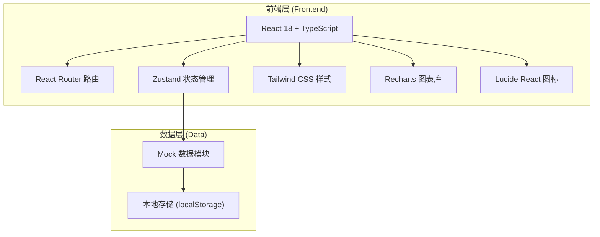

## 1. 架构设计



## 2. 技术选型说明

- 前端框架：React 18 + TypeScript，类型安全的组件化开发
- 构建工具：Vite 5，极速开发体验与热更新
- 路由管理：React Router v6，声明式路由与嵌套布局
- 状态管理：Zustand，轻量且高效的全局状态管理
- UI 样式：Tailwind CSS 3，原子化 CSS 快速构建界面
- 图表组件：Recharts，基于 React 的数据可视化图表
- 图标库：Lucide React，简洁优美的线性图标集
- 后端：无独立后端，使用前端 Mock 数据模拟业务逻辑

## 3. 路由定义

| 路由路径 | 页面名称 | 说明 |
|---------|---------|------|
| /dashboard | 首页看板 | 默认首页，展示数据概览 |
| /devices | 设备管理 | 设备列表、详情与远程控制 |
| /devices/map | 设备地图 | 地图模式查看设备分布 |
| /orders | 订单流水 | 取水订单列表与详情 |
| /packages | 充值套餐 | 套餐管理与上下架 |
| /alarms | 告警工单 | 告警列表、分派与处理 |
| /users | 用户账户 | 用户列表、余额、退款审核 |
| /reports | 统计报表 | 各类数据统计与图表 |
| /settings | 系统设置 | 权限、日志、参数配置 |
| /settings/roles | 角色管理 | 角色与权限配置 |
| /settings/logs | 操作日志 | 系统操作日志查看 |
| /login | 登录页 | 用户登录入口 |

## 4. 数据模型定义

### 4.1 TypeScript 类型定义

```typescript
// 设备信息
interface Device {
  id: string;
  deviceNo: string;
  building: string;
  floor: string;
  location: string;
  status: 'online' | 'offline' | 'warning';
  waterLevel: number;
  tds: number;
  ph: number;
  chlorine: number;
  temperature: number;
  pricePerLiter: number;
  totalWater: number;
  lastMaintenance: string;
  lng: number;
  lat: number;
}

// 订单信息
interface Order {
  id: string;
  orderNo: string;
  userId: string;
  userName: string;
  deviceId: string;
  deviceNo: string;
  waterAmount: number;
  amount: number;
  payMethod: 'balance' | 'wechat' | 'alipay';
  status: 'success' | 'failed' | 'refunded';
  createdAt: string;
  duration: number;
}

// 充值套餐
interface Package {
  id: string;
  name: string;
  price: number;
  bonus: number;
  totalValue: number;
  status: 'on' | 'off';
  sort: number;
  createdAt: string;
}

// 告警工单
interface Alarm {
  id: string;
  alarmNo: string;
  deviceId: string;
  deviceNo: string;
  type: 'water_low' | 'tds_high' | 'device_offline' | 'leak' | 'other';
  level: 'critical' | 'warning' | 'info';
  status: 'pending' | 'assigned' | 'processing' | 'resolved' | 'closed';
  description: string;
  assigneeId?: string;
  assigneeName?: string;
  createdAt: string;
  resolvedAt?: string;
  progress: number;
  remark?: string;
}

// 用户信息
interface User {
  id: string;
  userNo: string;
  name: string;
  phone: string;
  balance: number;
  totalRecharge: number;
  totalConsume: number;
  status: 'normal' | 'blocked';
  coupons: Coupon[];
  createdAt: string;
}

// 优惠券
interface Coupon {
  id: string;
  name: string;
  amount: number;
  validFrom: string;
  validTo: string;
  used: boolean;
}

// 退款申请
interface RefundRequest {
  id: string;
  refundNo: string;
  userId: string;
  userName: string;
  orderId: string;
  amount: number;
  reason: string;
  status: 'pending' | 'approved' | 'rejected';
  createdAt: string;
}

// 操作日志
interface OperationLog {
  id: string;
  userId: string;
  userName: string;
  action: string;
  module: string;
  detail: string;
  ip: string;
  createdAt: string;
}

// 角色权限
interface Role {
  id: string;
  name: string;
  description: string;
  permissions: string[];
}
```

## 5. 目录结构

```
src/
├── components/           # 通用组件
│   ├── Layout/          # 布局组件（侧边栏、顶栏）
│   ├── Card/            # 卡片组件
│   ├── Table/           # 表格组件
│   ├── Chart/           # 图表组件
│   ├── StatusTag/       # 状态标签
│   └── Modal/           # 弹窗抽屉
├── pages/               # 页面组件
│   ├── Dashboard/       # 首页看板
│   ├── Devices/         # 设备管理
│   ├── Orders/          # 订单流水
│   ├── Packages/        # 充值套餐
│   ├── Alarms/          # 告警工单
│   ├── Users/           # 用户账户
│   ├── Reports/         # 统计报表
│   └── Settings/        # 系统设置
├── store/               # 状态管理
│   ├── useAuthStore.ts
│   ├── useDeviceStore.ts
│   └── useGlobalStore.ts
├── data/                # Mock 数据
│   ├── devices.ts
│   ├── orders.ts
│   ├── users.ts
│   └── alarms.ts
├── types/               # 类型定义
│   └── index.ts
├── utils/               # 工具函数
│   ├── format.ts
│   └── mock.ts
├── App.tsx              # 应用入口
├── main.tsx             # React 入口
└── index.css            # 全局样式
```
